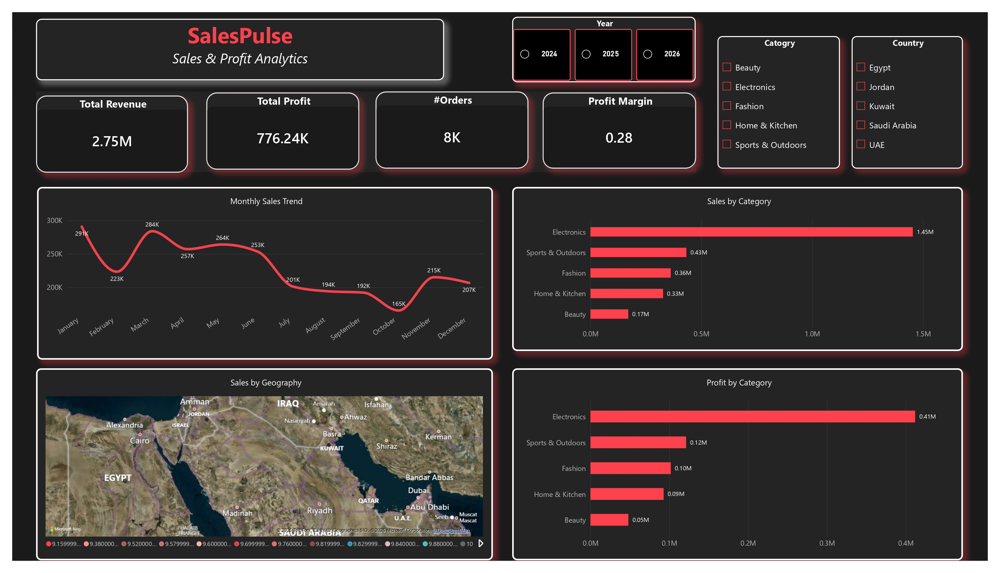
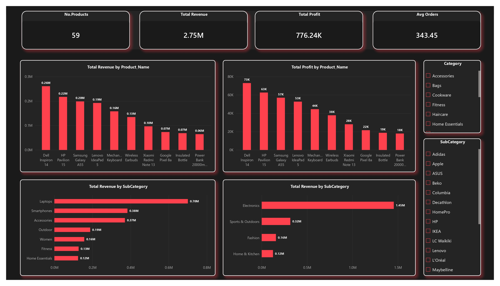
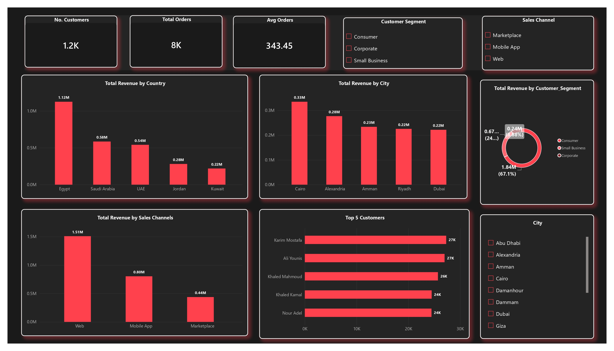
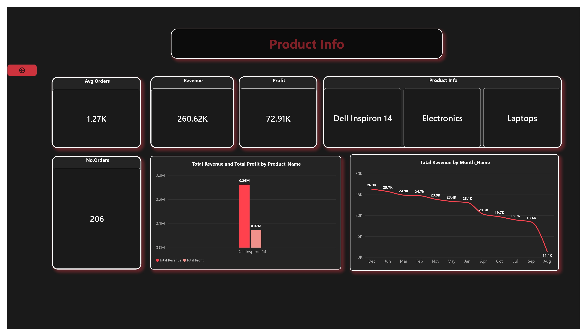
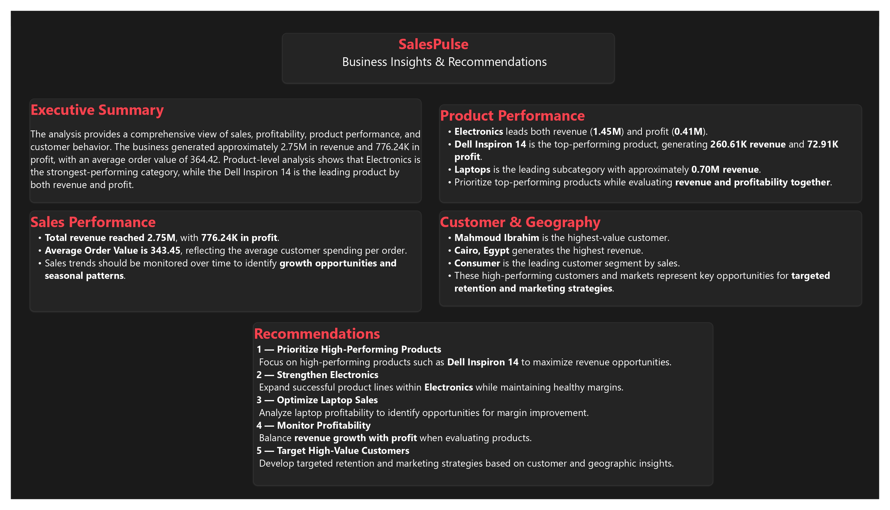

# SalesPulse: Sales & Profit Analytics Dashboard

## Project Overview
**SalesPulse** is an end-to-end business intelligence solution designed to provide deep insights into sales performance, profitability, product trends, and customer behavior. 
The project follows a complete data pipeline, from raw data extraction to an interactive Power BI dashboard, helping stakeholders make data-driven decisions.

**Key Metrics at a Glance:**
- **Total Revenue:** 2.75M
- **Total Profit:** 776.24K
- **Total Orders:** 8K
- **Profit Margin:** 0.28
- **Average Order Value:** 343.45

---

## 🔄 Project Workflow (Data Pipeline)
`Raw Data (CSV)` ➡️ `Python (Data Cleaning)` ➡️ `Staging Area` ➡️ `SSIS (ETL)` ➡️ `SQL Data Warehouse` ➡️ `Power BI (Dashboard)`

---

## Tech Stack & Tools
- **Data Cleaning & Preprocessing (Python):**
  - Used **Pandas** and **NumPy** to handle missing values, remove duplicates, and standardize data formats.
  - Performed feature engineering to create new metrics (e.g., Profit Margin, Average Order Value).
  - Exported the cleaned dataset to a staging area (CSV/SQL Server) for further processing.

- **ETL & Data Integration (SSIS - SQL Server Integration Services):**
  - Built an ETL pipeline to automate the extraction, transformation, and loading of data from the staging area into the Data Warehouse/Data Mart.
  - Orchestrated workflows to ensure data consistency and scheduled incremental loads.

- **Data Visualization & Dashboarding (Power BI):**
  - Designed an interactive **SalesPulse** dashboard with KPIs, trend lines, and geographical maps.
  - Created DAX measures for dynamic calculations (Revenue, Profit, Margins).
  - Connected Power BI directly to the SSIS-processed data model for real-time reporting.

---

## Dashboard Features & Insights

### 1. Executive Summary
- Tracks total revenue, profit, and order volume.
- Monitors overall profitability (Profit Margin = 0.28).
- **Top-Performing Product:** **Dell Inspiron 14** (Revenue: 260.61K | Profit: 72.91K).

### 2. Product Performance
- **Category Breakdown:**
  - **Electronics:** Revenue 1.45M | Profit 0.41M
  - **Sports & Outdoors:** Revenue 0.43M | Profit 0.12M
  - **Fashion:** Revenue 0.36M | Profit 0.10M
- **Top Subcategory:** **Laptops** with 0.70M revenue.

### 3. Geography & Customer Insights
- **Top Regions:** **Saudi Arabia** (0.58M), **UAE** (0.54M), and **Egypt** (0.5M).
- **Top Cities:** **Alexandria** (0.33M), **Cairo** (0.3M), and **Amman** (0.23M).
- **Customer Segments:**
  - **Consumer:** 67.1% of revenue
  - **Small Business:** 24%
  - **Corporate:** 8.9%
- **Top Customer:** **Mahmoud Ibrahim** (27K).

### 4. Sales Channels
- **Marketplace:** 0.80M
- **Web:** 0.50M
- **Mobile App:** 0.44M

---

## 📁 Dashboard Screenshots)






---

##  Business Recommendations
1. **Prioritize High-Performing Products:** Focus on **Dell Inspiron 14** to maximize revenue.
2. **Strengthen Electronics Category:** Expand product lines within Electronics while maintaining margins.
3. **Optimize Laptop Sales:** Analyze profitability to improve margins.
4. **Target High-Value Customers:** Develop retention strategies based on geographic and segment data.
5. **Balance Revenue & Profit:** Evaluate product performance holistically.

---

##  How to Run the Project (Local Setup)
1. **Clone the repository:**
   ```bash
   git clone https://github.com/DoniaHabib1/SalesPulse-Dashboard.git
2. Install dependencies: `pip install -r requirements.txt`
3. Run the cleaning script: `python src/data_cleaning.py`
4. **[Download the Full Case Study (PDF)](./SalesPulse_Analysis_CaseStudy.pdf)** for more details.
